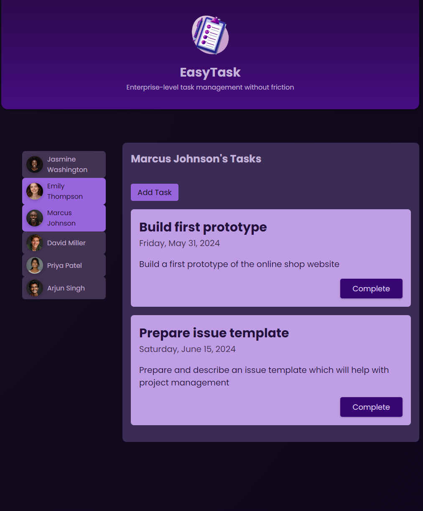
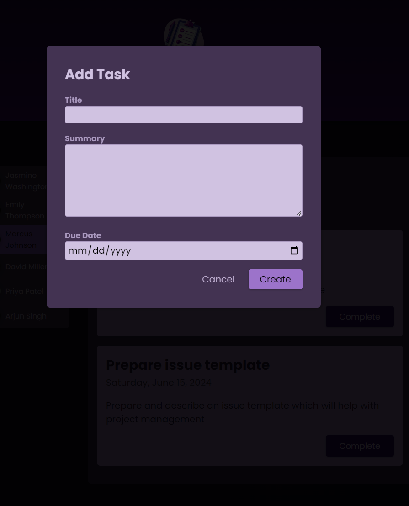

# EasyTask Management  

A simple yet powerful task management application built with **Angular 19**. EasyTask Management allows you to manage tasks for different users efficiently. The application leverages **localStorage** for simplicity in storing and managing data.  

## Features  

- **User Task Management**  
  - View the task list of any user.  
  - Mark tasks as completed (completed tasks are automatically removed).  
  - Add new tasks for any user.  

- **Persistent Storage**  
  - Data is stored locally in the browser using `localStorage`.  

- **Clean and Intuitive UI**  
  - User-friendly interface for managing tasks seamlessly.  

## Screenshots  

### Task List View  
Displays the tasks for the selected user. Tasks can be marked as completed directly from this view.  

  

### Add Task Form  
Simple form to add a new task for the selected user.  

  

## Installation  

1. Clone the repository:  
   ```bash  
   git clone https://github.com/your-username/easytask-management.git  
    ```
2. Navigate to the project directory:
    ```bash
    cd easytask-management
    ```  
3. Install dependencies:
    ```bash
    npm install
    ```  
4. Start the development server:
    ```bash
    ng serve
    ```  
5. Open the application in your browser at:
    ```bash
    http://localhost:4200
    ```  